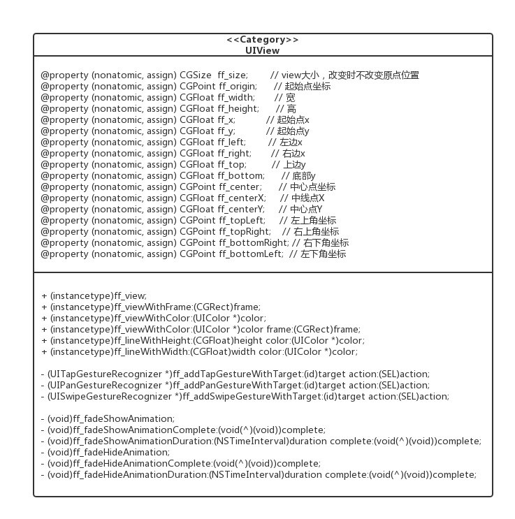
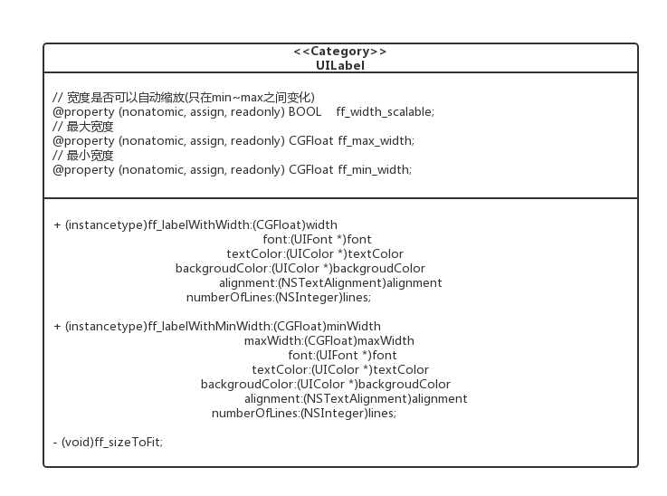
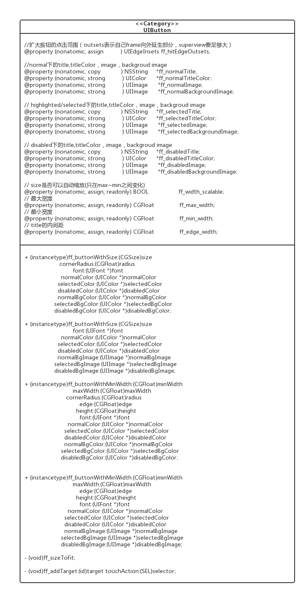
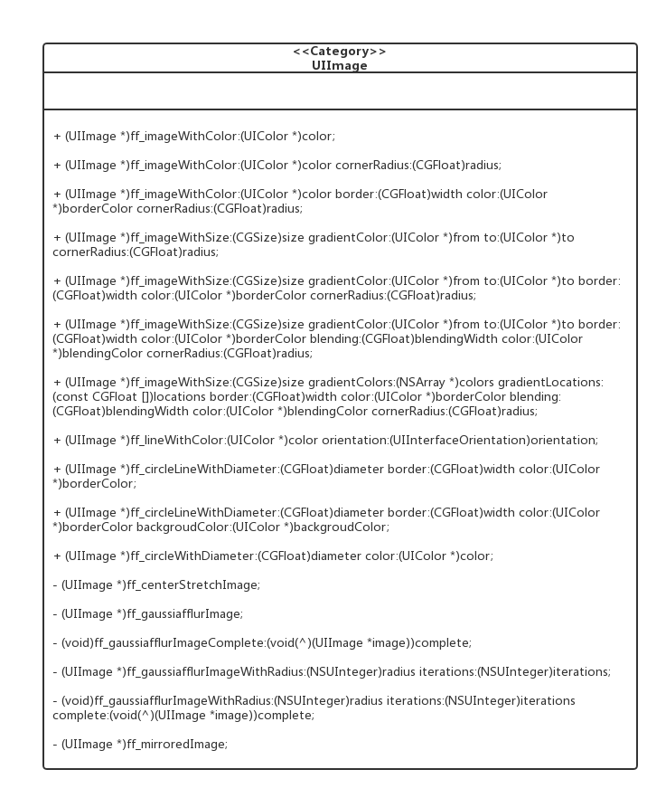
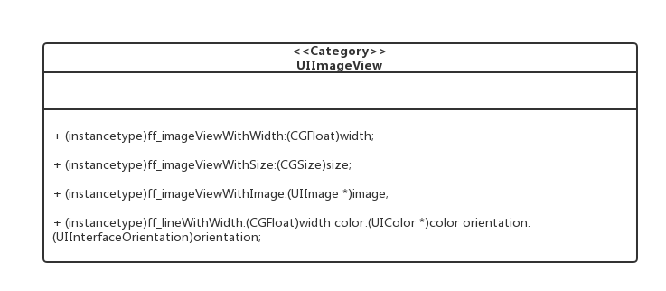
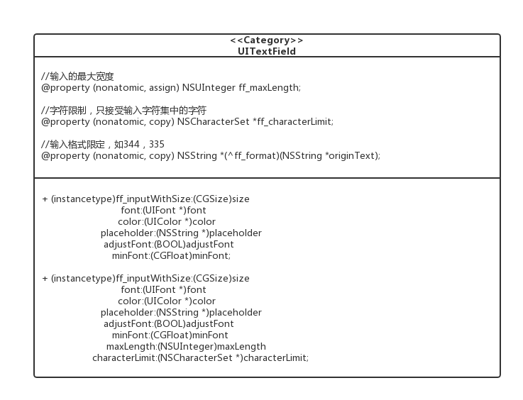
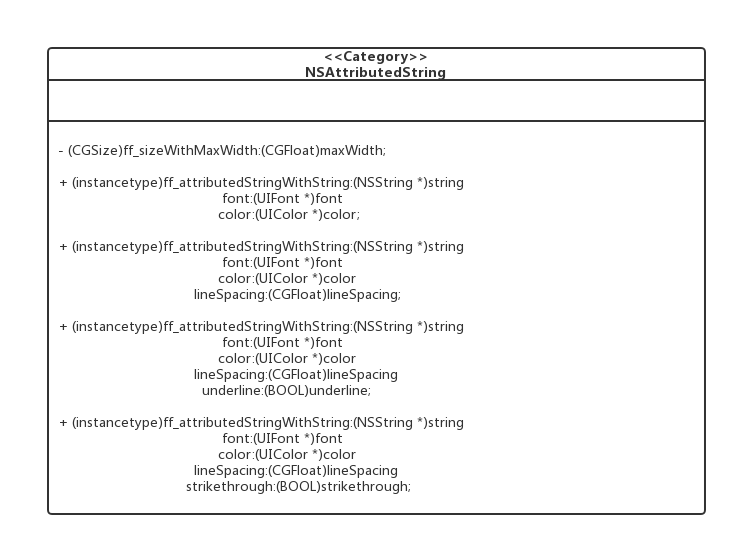
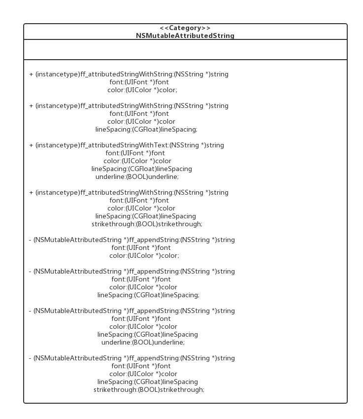
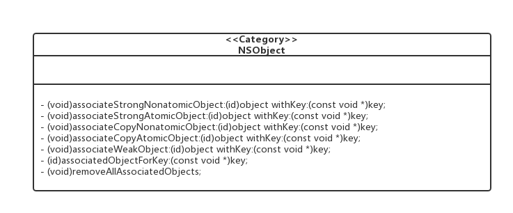
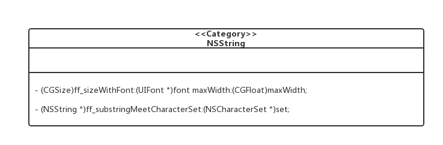

# [FFUIFactory](html/index.html)

## 简介
FFUIFactory是一个快速、灵活的构建UI的组件库，能有效的提升业务开发效率，降低代码冗余。组件都是基于「Category」的形式对常用的UI控件和依赖类分类，添加工厂方法和一些常用属性的快捷设置通道，抽取公有代码，形成不同的UI工厂，每个工厂细分职责，代码高度重用，把基础控件的一些常用功能配合UI一起提供给业务工程师。


## 联系Owner

QQ：273631976

> **从大量的使用场景来看，UIView、UILabel、UIButton、UIImageView、UITextField的使用是最频繁的，也是跟业务工程师打交道最多的，目前仅对这些控件做扩展，希望大家多提建议或者意见。*

## 使用说明

将 [项目结构](https://github.com/liubin303/FFUIFactory#项目结构) 中提到的 FFUIFactory 这个「文件夹」拖拽到项目中。

请参考Example工程
├── FFUIFactory
│   ├── FFUIFactoryViewController
│   ├── UIViewSampleViewController
│   ├── UILableSampleViewController
│   ├── UIButtonSampleViewController
│   ├── UIImageViewSampleViewViewController
│   ├── UITextFieldSampleViewController

> *注意：为控件设置任意约束之后，用工厂方法初始化时设置的frame都会被覆盖失效，包括ff_sizeToFit方法也会失效。
>如果你习惯使用设置frame控制控件的样式，使用工厂方法创建控件时传入的width、size、frame参数需要传入有意义的值。
>如果你习惯使用约束来控制控件的样式，使用工厂方法创建控件时传入的width、size、frame参数都传0、CGSizeZero、CGRectZero等值即可.*

## 项目结构

```
├── FFUIFactory ＃组件库文件夹
│   ├── FFUIFactory.h  # 这是整个库的入口，建议导入pch。
│   ├── NSAttributedString+FFUIFactory.h
│   ├── NSAttributedString+FFUIFactory.m
│   ├── NSMutableAttributedString+FFUIFactory.h
│   ├── NSMutableAttributedString+FFUIFactory.m
│   ├── NSObject+AssociatedObjects.h
│   ├── NSObject+AssociatedObjects.m
│   ├── NSString+FFUIFactory.h
│   ├── NSString+FFUIFactory.m
│   ├── UIView+FFUIFactory.h
│   ├── UIView+FFUIFactory.m
│   ├── UILabel+FFUIFactory.h
│   ├── UILabel+FFUIFactory.m
│   ├── UIButton+FFUIFactory.h
│   ├── UIButton+FFUIFactory.m
│   ├── UIImageView+FFUIFactory.h
│   ├── UIImageView+FFUIFactory.m
│   ├── UIImage+FFUIFactory.h
│   ├── UIImage+FFUIFactory.m
│   ├── UITextField+FFUIFactory.h
│   ├── UITextField+FFUIFactory.m
└── 
```

### UIView+FFUIFactory


* 支持生产一个指定颜色、frame的UIView
* 支持生产一个高度/宽度1px*屏幕scale的线行UIView
* 快速添加手势
* 快速添加渐隐渐出基础动画
* 支持快速访问和修改各种坐标和大小

### UILabel+FFUIFactory


* 支持生产一个指定宽度的UILabel
* 支持生产一个宽度可变的UILable
* 支持配置字体、颜色、背景、对其方式、显示行数
* 支持基于设置frame的宽高自动计算

### UIButton+FFUIFactory


* 支持生产一个指定size的UIButton
* 支持生产一个高度固定宽度可变的UIButton，高度和title内间距可配置
* 支持配置title字体和各状态下的颜色
* 支持以颜色+圆角的方式设置按钮各状态下的背景图
* 支持图片的方式设置按钮各状态下的背景图
* 支持以属性的方式修改按钮各状态下的title、image和背景图
* 添加了一个便捷一点的添加action的方法
* 支持不改变按钮大小的前提下扩大点击响应区域
* 支持基于设置frame的宽高自动计算

### UIImage+FFUIFactory


* 支持生产一个指定颜色/圆角/带边框的图片
* 支持生成一个渐变色/圆角/带边框的图片
* 支持生产一个1像素的图片
* 支持生产一个空心/实心圆
* 支持图片中间拉伸
* 支持绘制毛玻璃和倒影

### UIImageView+FFUIFactory


* 支持生产一个宽高相等的UIImageView
* 支持生成一个指定size的UIImageView
* 支持生产一个指定图片的UIImageView
* 支持生产一个1像素高的线条UIImageView

### UITextField+FFUIFactory


* 支持生产一个指定大小的UITextField
* 支持配置字体、颜色、提示字符、是否自适应、最大长度限制、输入字符限制
* 支持访问和修改最大长度限制、输入支付限制、输入完成格式化

### NSAttributedString+FFUIFactory


* 支持计算NSAttributedString的size
* 支持生产一个内容、字体、颜色、行间距、下划线、中划线可配置的NSAttributedString

### NSMutableAttributedString+FFUIFactory


* 支持生产一个内容、字体、颜色、行间距、下划线、中划线可配置的NSMutableAttributedString
* 支持向现有NSMutableAttributedString追加一个内容、字体、颜色、行间距、下划线、中划线可配置的NSMutableAttributedString

### NSObject+AssociatedObjects


* 支持添加、删除关联对象

### NSString+FFUIFactory


* 支持计算文本所占用的size
* 支持过滤字符


